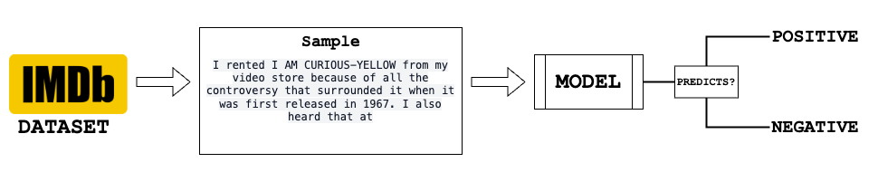

# Binary Classifier with MLP Models and SentencePiece Tokenization


This project performs **classification** on the [IMDB dataset](https://huggingface.co/datasets/imdb) using **Multi-Layer Perceptron (MLP)** models with **SentencePiece** tokenization. The notebook trains and compares single-layer and two-layer MLP architectures, evaluates their performance, and conducts error analysis to understand model misclassifications.

## Installation

Before running the notebook, ensure you have Python installed (preferably version 3.7 or higher). The required packages can be installed using `pip`. It's recommended to use a virtual environment to manage dependencies.

### Step 1: Clone the Repository

```bash
git clone https://github.com/your-username/imdb-sentiment-analysis.git
cd imdb-sentiment-analysis
```

### Step 2: Create a Virtual Environment (Optional but Recommended)

```bash
python3 -m venv env
source env/bin/activate  # On Windows: env\Scripts\activate
```

### Step 3: Install Required Packages
Run the following command to install all necessary packages:

```bash
pip install sentencepiece torch==2.3.0 torchtext==0.18.0 torchdata portalocker>=2.0.0 datasets matplotlib scikit-learn
```

Note: Specific versions of torch and torchtext are required for compatibility. Ensure that your CUDA version (if using GPU) is compatible with PyTorch 2.3.0.

## Dependencies
The project relies on the following Python packages:
- **Core Libraries:**
  - **PyTorch** (`torch==2.3.0`)
  - **TorchText** (`torchtext==0.18.0`)
  - **TorchData**
  - **Datasets**

- **Tokenization:**
  - **SentencePiece**

- **Utilities:**
  - **Portalocker** (`portalocker>=2.0.0`)
  - **Matplotlib**
  - **NumPy**
  - **Scikit-Learn**

- **Others:**
  - Python's built-in modules: `os`, `random`, `collections`

Install dependencies using:
```bash
pip install -r requirements.txt
```

## License
This project is licensed under the MIT License. Feel free to use and modify it as per your requirements.